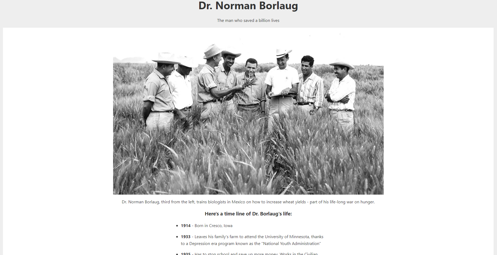

# Dr.-Norman-Borlaug

This is a solution to the [Build a Tribute Page on freecodecamp](https://www.freecodecamp.org/learn/2022/responsive-web-design/build-a-tribute-page-project/build-a-tribute-page). freecodecamp challenges help you improve your coding skills by building realistic projects. 

## Table of contents

- [Overview](#overview)
  - [Screenshot](#screenshot)
  - [Links](#links)
- [My process](#my-process)
  - [Built with](#built-with)
- [Author](#author)
- [Acknowledgments](#acknowledgments)

## Overview

### Screenshot

### Links

- Solution URL: [Solution](https://github.com/nikamerebashvili95/Dr.-Norman-Borlaug)
- Live Site URL: [GitHub Live URL](https://nikamerebashvili95.github.io/Dr.-Norman-Borlaug/)

## My process

### Built with

- Semantic HTML5 markup
- CSS custom properties
- Mobile-first workflow

## Author

- GitHub - [Nika Merebashvili](https://github.com/nikamerebashvili95)

## Acknowledgments

special thanks goes to freecodecamp, for the opportunity to learn web development

- Freecodecamp: [Freecodecamp](https://www.freecodecamp.org/learn)
